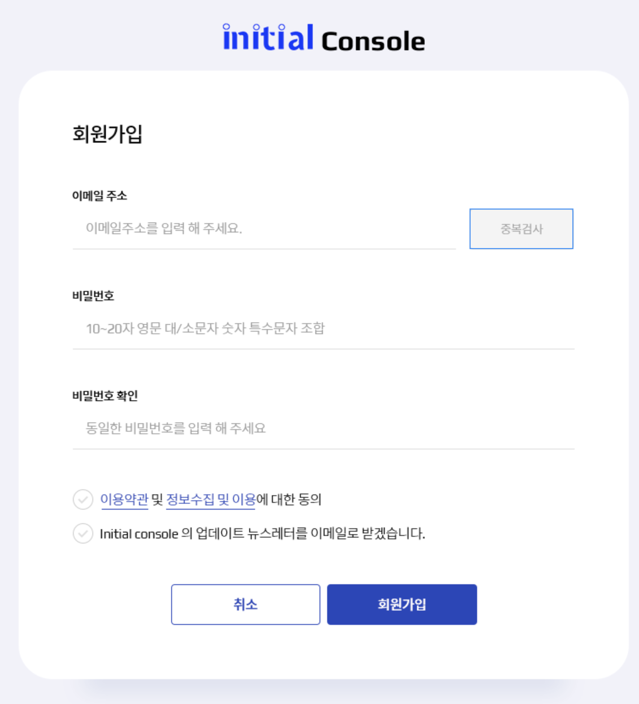
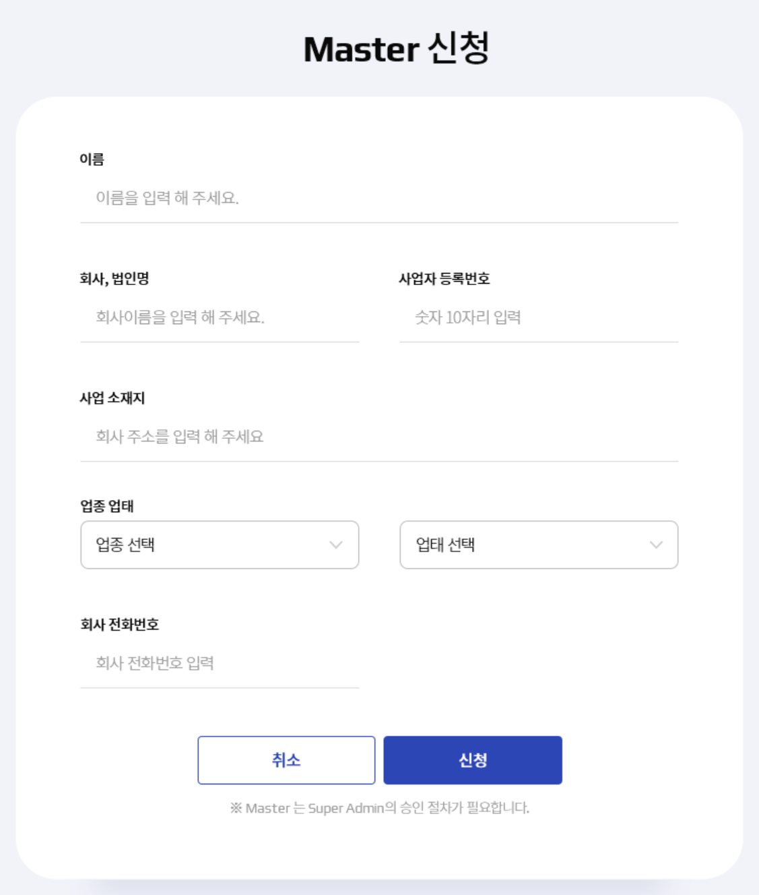
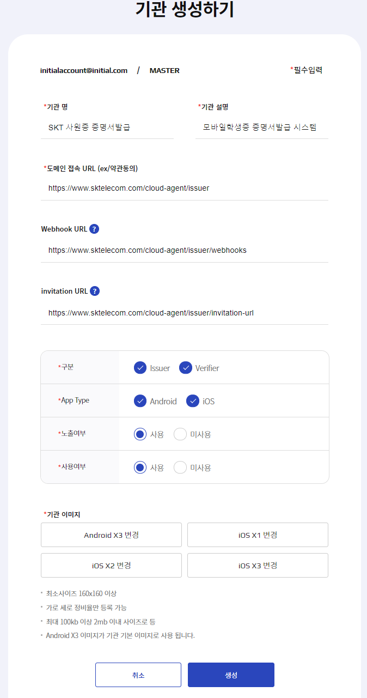
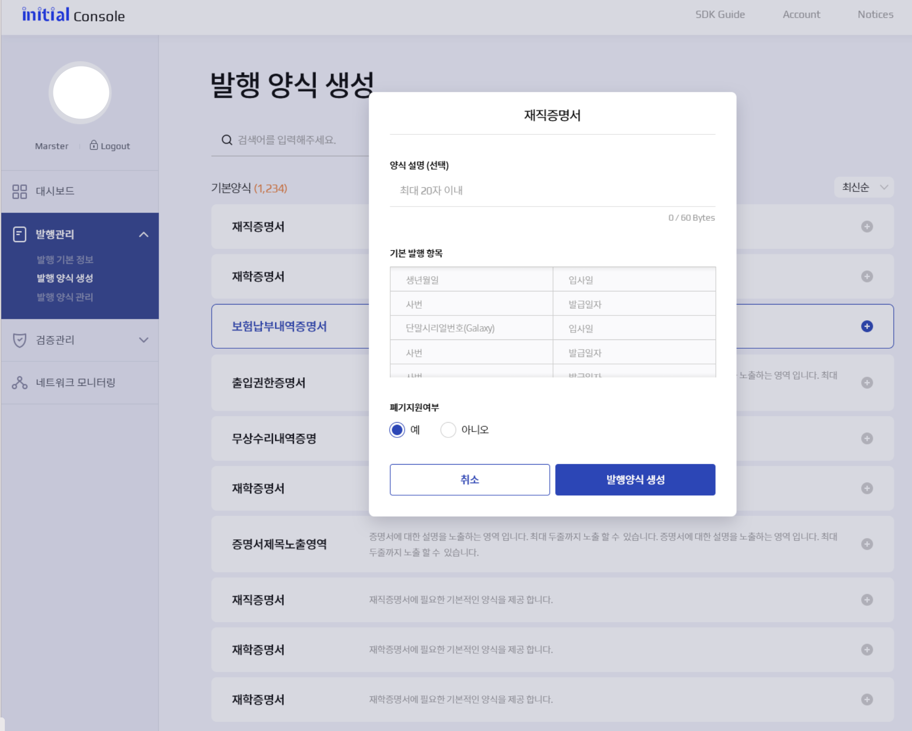
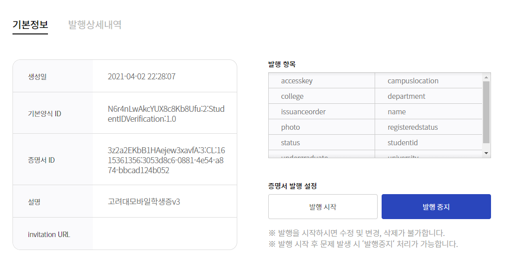
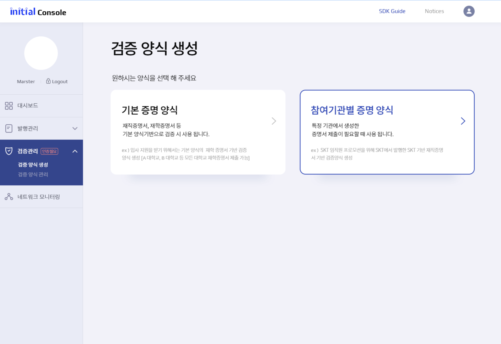
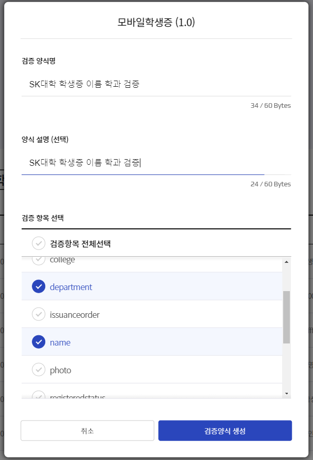
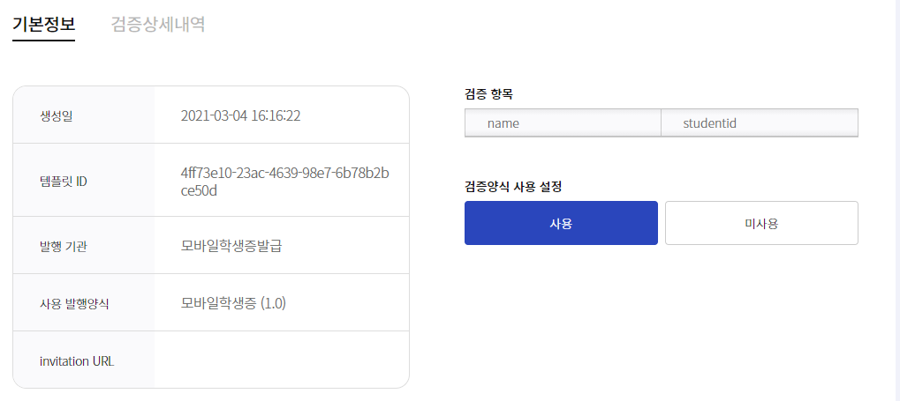

# Web Console 사용 Guide

* initial DID platform 사용을 위해서는 회원가입을 통한 자격을 취득 해야함 

    * 참고 : 2021년 2월 현재 사업자등록번호를 가진 기관사용자만 이용 가능 (추후 개인 사용자 확대 예정)  

#### 1. 회원 가입

E-mail기반 회원 가입 진행
  

#### 2. Master 신청
Master는 기관을 생성하고 증명서 양식을 생성하거나 검증할 수 있는 권한이 부여 되고, Member를 기관에 초대할 수 있음. 

Master 권한이 필요없는 일반 User는 초대를 통해서 platform 사용 가능(읽기권한만 부여)

회원가입 후 기관 사용자는 Master 신청을 진행
* Master 신청 시 사업자번호 등 회사 정보 등록
* 심사를 통해 Master 자격 승인 부여

#### 3. 기관생성하기 
Master는 '기관 생성하기' 버튼을 클릭하여 기관(Organization)을 여러개 생성 가능

* 2021.02 현재 최대 5개까지 기관 생성 허용

하나의 기관으로 여러 서비스를 진행 하거나, 각 기관마다 서비스를 분리 가능함.

* 사용자의 혼돈을 최소화 하기 위해서는 하나의 기관으로 다수의 서비스 하는 것을 추천

기관마다 독립된 Public DID와 Private/Public Key/API Access Token이 생성

* 해당 정보는 기관정보에서 확인할 수 있음 

이미 기관이 생성되어 있다면 해당 리스트가 표시된다.

* Owner : 기관의 주인으로 보통 생성한 Master가 Owner가 된다. 다른 User에게 위임도 가능하다 
* Member : Owner의 초대를 받아 들어올 수 있다. Read의 권한만 주어진다. 

  

기관 생성을 위해서는 아래와 같은 정보가 필요하다
1. 기관명 : 등록하고자 하는 기관명칭
2. 기관 설명 : 기관의 설명
3. 도메인 접속 URL : Webhook등 Cloud Agent와 통신하기 위한 기관의 서버
4. Webhook URL : Cloud Agent로부터 처리 결과를 받기 위한 Webhook 서버 주소
5. Invitation URL : initial app의 기관 icon을 클릭하였을때 최조 연결을 위한 기관의 초대장 주소
6. 구분(기관의 역할) : issuer/verifier 둘다 선택가능. 
7. App Type : 노출을 원하는 App Type
8. 노출여부 : App 노출 여부
9. 사용여부 : 사용 여부
10. 기관 이미지 : initial app의 기관 노출 아이콘

  

기관 생성후 생성되는 정보는 아래와 같다

1. Public DID
   - Blockchain ledger에 기록되는 기관 대표 ID
2. Access Token: 
   - Cloud Agent에 접근하기 위한 비밀 Key.
   - 해당 Access Token이 노출되면 타인에 의해 악용되거나, 추가적인 과금이 발생할 수 있어 정보를 안전하게 관리해야 한다.
   - Access Token 유출로 변경을 원할 시 initial 관리자에게 문의 
3. Agent Service API URL : Cloud Agent API 호출 URL Path. 아래 예시 참조
   - `curl --location --request GET '//agent/api/wallet/did' \
--header 'Authorization: Bearer {{AccessToken}}'` 

  

#### 4. 발행양식 생성하기 

증명서 발행을 위해서는 각 기관마다 발행양식(Credential Definition ID) 생성이 필요하다. 
발행양식은 기본양식(Schema ID)기반으로 폐기지원여부, 증명서이름 설정값을 추가하여 생성이 가능하다. 
initial은 재직증명서, 재학증명서등 기본양식을 미리 제공한다. 

    example) initial회사에서 재직증명서 발행을 위해서는 initial재직증명서 발행양식을 생성한 후, initial app에 발행 가능하다.  

* 새로운 기본양식 생성이 필요하면 initial 관리자에게 별도 요청해야 한다.

생성된 발행양식은 해당 기관에서만 사용 가능하다.
 

  

생성된 발행 양식 정보
1. 생성일
2. 기본양식ID : 발행양식 생성을 위해 사용한 Schema ID
3. 증명서ID : 기본양식(Schema)를 통해 생성된 기관 전용 증명서 양식 ID. 
4. 증명서 발행 설정 : 발행시작/중지 선택 가능

  

#### 5. 발행하기 

VC발행을 위해서는 Cloud Agent Open APIs를 사용하여 진행.

* Open API 사용하기 위해서는 기관의 API Access Token과 증명서양식I(Credential Definition ID)가 필요함
  
  

#### 6. 검증양식 생성하기 

증명서 검증을 위해서는 제출 받을 증명서양식(Verification Template ID) 생성이 필요하다. 
검증양식 생성을 위해서는 제출 받을 양식의 몇가지 제약사항을 설정해야 한다. 

1. 기본양식(Schema ID)기반으로 생성 : 해당 기본양식으로 발행된 모든 증명서 제출 가능 (SKT재직증명,삼성전자재직증명서,LG전자재직증명서등 모두 제출 가능)
2. 참여기관별 증명양식(Credential Definition ID)기반 생성  : 특정 증명서만 제출 가능 (SKT재직증명서만 제출 가능. 다른 재직증명서는 검증실패)

initial에서 제공하는 증명서 양식 기반으로 제출 받을 내용을 선택하면 된다. 

    example) SKT임직원 행사를 위해 'SKT재직증명서'의 회사명과 이름을 제출하게 양식 생성 

* 영지식증명, 멀티증명서제출검증등 항목 생성은은 향후 지원 예정.

 

  
사용자로 부터 제출받아 검증하기 원하는 항목 선택

  
생성된 템플릿ID는 향후 검증 요청 시 활요

  

#### 7. 검증하기 

VC발행을 위해서는 Open API를 사용하여 진행.

* Open API 사용하기 위해서는 기관의 API Access Token과 Verification Template ID 필요함
* 상세 내용은 API Guide 문서 참고